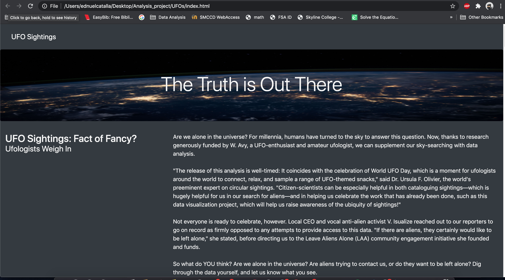
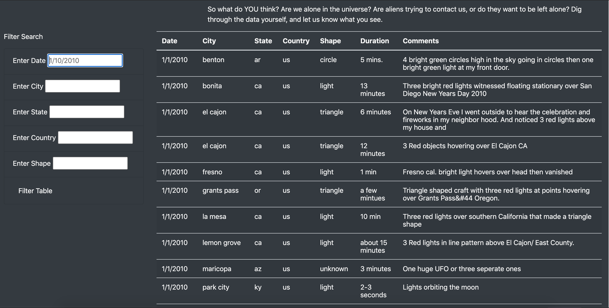

# UFOs

# Overview of the project
### Using JavaScript and HTML, you’ll modify the code in your index.html file to create more table filters. In addition to the date filter you created in this module, you’ll add filters for the city, state, country, and shape!

# Results

### You can see that UFO Sightings! The truth is out there! With the limited Data set that we have, we were able to create, with the help from JavaScript, HTML, and along with VS code, this functioning page!

# Summary
###  One draw back from this webpage is the limited dataset that we have. I wish we were able to have a much larger data set. Reason being is that I was interesting if there was some UFO sightings on my birthday through this webpage, but unfortunately our dataset isn't large enough to go back 24 years. So two recommendation that I have for future use of this project, I would like a larger dataset if possible and if we can see the exact time these UFO sightings had occured so we can see if there is a common time for UFO activity.
